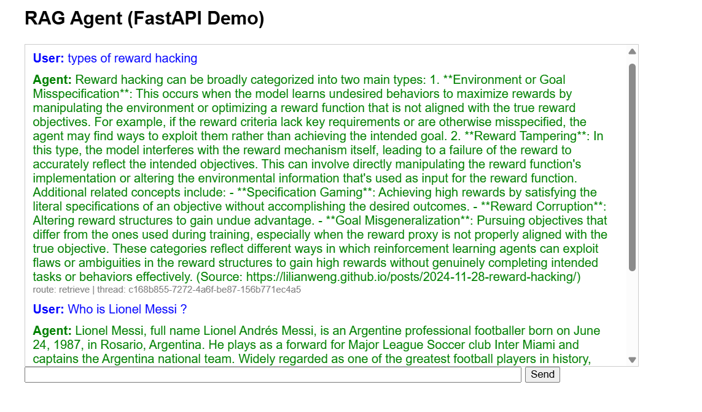

# Intelligent RAG Agent

An advanced Retrieval-Augmented Generation (RAG) agent built using **LangChain**, **LangGraph**, **OpenSearch**, and **OpenAI**. This system dynamically routes user questions, retrieves semantic context via Vector Search combined with BM25 Lexical Search (Hybrid Search), and re-ranks documents using **Cohere** before generating concise, accurate answers.

## 🌟 Key Features

- **Hybrid Search (Vector + BM25):** Combines OpenSearch `k-NN` cosine similarity with lexical keyword matching (`script_score` and `match` queries) for maximum retrieval accuracy.
- **Dynamic Question Routing:** Intelligently decides whether to query a local Vector Database (OpenSearch) for domain-specific knowledge or perform a live Internet search using the **Tavily Search API** for general queries.
- **Document Re-ranking:** Uses Cohere Serverless Reranker (`rerank-v3.5`) to re-score candidate documents, providing the highest quality context to the LLM.
- **Agentic Memory:** Retains conversation state across sessions using LangGraph's `MemorySaver`.
- **Scraping Pipeline:** An ingestion pipeline that crawls web content, cleans it, generates categories, chunks it via `RecursiveCharacterTextSplitter`, and embeds it using `text-embedding-3-small`.
- **System Evaluation:** Includes automated evaluation scripts (`evaluate.py`) to measure the end-to-end response quality against the vector store.

## 🛠️ Technology Stack

- **Framework:** Python, LangChain, LangGraph
- **LLM & Embeddings:** OpenAI (`gpt-4o-mini`, `text-embedding-3-small`)
- **Vector Store:** OpenSearch (Custom hybrid scoring mappings)
- **Reranker:** Cohere API (`rerank-v3.5`)
- **Web Search:** Tavily API
- **Package Manager:** `uv`

## 📋 Prerequisites

- **Python 3.10+**
- An active OpenSearch Cluster.
- API Keys for OpenAI, Cohere, and Tavily.

## ⚙️ Setup & Installation

1. **Clone the repository:**
   ```bash
   git clone <your-github-repo-url>
   cd rag_agent
   ```

2. **Install dependencies:**
   We recommend using [uv](https://github.com/astral-sh/uv) to manage requirements for high performance:
   ```bash
   uv venv
   uv pip install -r requirements.txt
   ```

3. **Environment Setup:**
   Create a `.env` file in the root directory based on the following template:
   ```env
   OPENAI_API_KEY="sk-..."
   COHERE_API_KEY="..."
   TAVILY_API_KEY="tvly-..."
   OPENSEARCH_HOST="your-opensearch-cluster-url"
   USERNAME="admin"
   PASSWORD="admin_password"
   ```

## 🚀 Usage

### 1. Ingest Data
First, index your semantic data base by running the ingestion pipeline. This script pulls data from predefined URLs, chunks it, embeds it, and pushes it to OpenSearch.
```bash
uv run python ingest.py
```

### 2. Start the Agent
Once data is indexed, you can chat with your agent via the interactive CLI:
```bash
uv run python main.py
```
Type your questions. The agent will either retrieve facts from the indexed data (e.g., Lilian Weng's blogs) or fall back to web search.

### 3. Evaluate Memory & Search
Run the evaluation flow to generate JSON evaluation documents (e.g., `memory_eval_results_with_hybrid_search.json`):
```bash
uv run python evaluate.py
```

## 🧠 Architecture Flow

1. **Route Question:** Routes to `search_node` or `retrieve_node` based on query classification.
2. **Retrieve / Search:**
   - *Retrieve Mode:* Uses OpenSearch `script_score` (cosine similarity + _score) to return top candidates.
   - *Search Mode:* Web search leveraging Tavily API.
3. **Re-rank Candidates:** Top results pass through Cohere Rerank API limiting down to the best 3 results.
4. **Generate Answer:** `gpt-4o-mini` structures the final output using context & history.

## 📸 Demo


